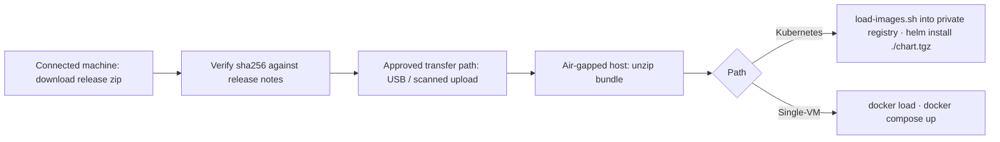

For environments with no internet access. Everything needed to install, upgrade, and operate NodePad is shipped in a single zip bundle attached to each [GitHub Release](https://github.com/palazski/nodepad-api/releases).

<Info>
  NodePad's air-gap story is a **packaging guarantee**, not a network-policy one. The install requires no internet access. In operation, outbound calls are made only to the LLM providers you explicitly configure (Anthropic, OpenAI) using keys you supply. If your environment has no egress to those providers either, follow your internal mirror / proxy policy for those endpoints.
</Info>



## The bundle

Each release ships `nodepad-X.Y.Z.zip` containing:

```
nodepad-X.Y.Z/
├── images/
│   ├── api.tar.gz          # docker save ghcr.io/palazski/nodepad-api:X.Y.Z
│   └── frontend.tar.gz     # docker save ghcr.io/palazski/nodepad-frontend:X.Y.Z
├── chart/
│   └── nodepad-X.Y.Z.tgz   # Helm chart package
├── load-images.sh          # Load & retag script
├── docker-compose.yml      # Single-VM install path (image-only)
├── .env.example            # Compose env template
├── values-template.yaml    # Helm values template
├── INSTALL.md              # Install instructions
└── VERSION                 # Plain text version marker
```

## Transfer

<Steps>
  <Step title="Download the bundle on a connected machine" icon="download">
    Grab the release zip from the GitHub Release page.
  </Step>
  <Step title="Verify the checksum (sha256) against the release notes" icon="shield-check">
    Release notes list the expected hash.
  </Step>
  <Step title="Move the zip through your approved transfer path" icon="usb">
    USB, DMZ, sneaker-net, whatever your policy mandates.
  </Step>
</Steps>

## Install (Kubernetes)

**Prerequisites** inside the air-gapped environment:
- A Kubernetes cluster (1.24+)
- Helm 3.8+
- An internal container registry (Harbor / Nexus / registry:2) reachable from the cluster

```bash
# 1. Unzip
unzip nodepad-0.1.0.zip
cd nodepad-0.1.0

# 2. Authenticate to your internal registry
docker login registry.internal.corp

# 3. Load images and retag+push to your registry
./load-images.sh registry.internal.corp/nodepad

# 4. Copy values-template.yaml to values.yaml; fill in:
#    - image.registry: registry.internal.corp
#    - image.repository: nodepad
#    - externalPostgres.url / externalRedis.url / externalS3.*
#    - secrets.djangoSecretKey / secrets.fernetKey
#    - ingress.hosts

# 5. Install the chart from the local tgz
helm install nodepad ./chart/nodepad-0.1.0.tgz -f values.yaml

# 6. Create the first admin user
kubectl exec -it deploy/nodepad-nodepad-api -- python manage.py createsuperuser
```

## Install (single-VM)

```bash
unzip nodepad-0.1.0.zip
cd nodepad-0.1.0

# Load images locally
gunzip -c images/api.tar.gz      | docker load
gunzip -c images/frontend.tar.gz | docker load

# Fill in .env, then start
cp .env.example .env
$EDITOR .env
docker compose up -d

docker compose exec api python manage.py createsuperuser
```

## Upgrades (air-gapped)

Upgrade flow is identical to install, just with a newer bundle:

```bash
./load-images.sh registry.internal.corp/nodepad          # pushes the new version's images
helm upgrade nodepad ./chart/nodepad-0.2.0.tgz -f values.yaml
```

The Helm `pre-upgrade` hook runs migrations before api pods roll. If migrations fail, the upgrade aborts and existing pods keep serving the old version.

## Verifying image integrity

After `./load-images.sh`:

```bash
docker inspect registry.internal.corp/nodepad/nodepad-api:0.1.0 | grep -i digest
```

The digest should match what's published on GHCR for the same semver tag. NodePad never overwrites immutable `X.Y.Z` or `<git-sha>` tags, so this digest is stable forever.

## Zero outbound telemetry — shipped default

<Note>
  **Self-hosted NodePad installs make zero outbound telemetry calls unless the operator explicitly sets `NODEPAD_POSTHOG_KEY`.**
</Note>

Specifically, with `NODEPAD_POSTHOG_KEY` unset (the default):

- **PostHog analytics are OFF.** The frontend loads but never initialises the PostHog client and never contacts any PostHog endpoint.
- **No update-check endpoint.** NodePad does not phone home to discover new releases, license status, or anything else.
- **No error-reporting endpoint.** No Sentry, no Rollbar, no vendor support hook wired in.
- **LLM providers are contacted only on user action.** Anthropic / OpenAI / any other configured provider receives a request *only* when a signed-in user sends a message to a model whose API key their admin (or they themselves) has configured. Disabling every provider in the admin panel brings outbound LLM traffic to zero.

**Network-review sign-off sentence:** *"NodePad, as shipped, makes no outbound network calls of its own; only user-initiated LLM calls to the providers the operator has configured."*

## Limitations of air-gapped installs

<Columns cols={3}>
  <Card title="No automatic update notifications" icon="bell" type="warning">
    Operators must track releases manually via the [changelog](/changelog) or GitHub Releases.
  </Card>
  <Card title="No telemetry signals" icon="gauge-circle" type="warning">
    Sentry and PostHog are opt-in and can be left blank.
  </Card>
  <Card title="No in-app version check" icon="tag" type="warning">
    To see what's running:
    ```bash
    kubectl get deploy nodepad-nodepad-api \
      -o jsonpath='{.spec.template.spec.containers[0].image}'
    ```
  </Card>
</Columns>
