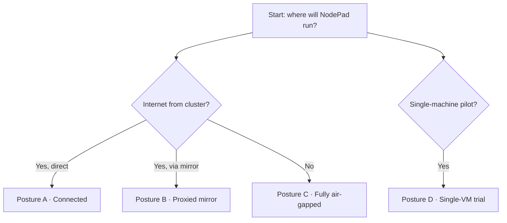

import { FeatureGrid } from '/snippets/FeatureGrid.jsx';
import { Callout } from '/snippets/Callout.jsx';

NodePad ships as a set of container images and a Helm chart. The same artifacts serve every supported install posture. Choose the row that matches your environment, then follow that section below.



| Posture | Network | Consumes | Install path |
|---|---|---|---|
| **A. Connected** | Public internet | GHCR + OCI Helm chart | `helm install … oci://ghcr.io/…` or `docker compose up` |
| **B. Proxied air-gap** | Private, with registry mirror | GHCR via Nexus / Harbor / Artifactory | Retarget `image.registry` to your mirror |
| **C. Fully air-gapped** | No internet | Offline zip bundle from GitHub Release | `./load-images.sh` + `helm install ./chart.tgz` |
| **D. Trial / single-VM** | Public internet or offline | GHCR images or bundle | `docker compose up` |

## Prerequisites

<AccordionGroup>
  <Accordion title="All postures">
    - Linux x86_64 (v0.1 is single-arch)
    - TLS certificate for your API and frontend domains
    - Generated secrets:
      - Django secret key — `python -c "import secrets; print(secrets.token_urlsafe(50))"`
      - Fernet key — `python -c "from cryptography.fernet import Fernet; print(Fernet.generate_key().decode())"`
  </Accordion>
  <Accordion title="Kubernetes postures (A / B / C)">
    - Kubernetes 1.24+
    - Helm 3.8+ (OCI chart support)
    - An ingress controller (nginx-ingress recommended)
  </Accordion>
  <Accordion title="Single-VM (D)">
    - Docker 24+ with Compose v2
  </Accordion>
  <Accordion title="External services (or use bundled Bitnami sub-charts for POC)">
    - PostgreSQL 15+
    - Redis 6+
    - S3-compatible object storage (AWS S3, Cloudflare R2, DO Spaces, MinIO)
  </Accordion>
</AccordionGroup>

## Posture A — Connected install (Kubernetes)

<Steps>
  <Step title="Pull the values template">
    ```bash
    curl -o values.yaml https://raw.githubusercontent.com/palazski/nodepad-api/master/helm/values-template.yaml
    ```
    Open `values.yaml` and fill in secrets, database URL, S3 credentials, and hostnames.
  </Step>
  <Step title="(If packages are private) log Helm in to GHCR">
    Use a GitHub token with at least `read:packages` scope on the owning account:
    ```bash
    echo "$GITHUB_TOKEN" | helm registry login ghcr.io -u <github-user> --password-stdin
    ```
  </Step>
  <Step title="Install the chart">
    ```bash
    helm install nodepad oci://ghcr.io/palazski/charts/nodepad \
      --version 0.1.0 \
      -f values.yaml
    ```
  </Step>
  <Step title="Create the first admin user (one-time)">
    ```bash
    kubectl exec -it deploy/nodepad-nodepad-api -- python manage.py createsuperuser
    ```
  </Step>
</Steps>

## Posture B — Proxied air-gap (Kubernetes with internal registry)

Your internal registry (Nexus / Harbor / Artifactory) must proxy GHCR (`ghcr.io`) and cache the NodePad images. Point the chart at your mirror via a single value:

```yaml values.yaml (excerpt)
image:
  registry: nexus.company.com/ghcr-proxy
  repository: palazski
  # tag defaults to chart appVersion
  pullSecrets:
    - name: nexus-creds  # if your mirror requires auth
```

Install as in Posture A.

## Posture C — Fully air-gapped install

<Steps>
  <Step title="Download the bundle on a connected machine">
    Grab `nodepad-0.1.0.zip` from the [GitHub Release](https://github.com/palazski/nodepad-api/releases).
  </Step>
  <Step title="Transfer to the air-gapped environment">
    USB, DMZ, approved file transfer — whatever your policy mandates.
  </Step>
  <Step title="Load images into your internal registry">
    ```bash
    unzip nodepad-0.1.0.zip
    cd nodepad-0.1.0
    ./load-images.sh registry.internal.corp/nodepad
    ```
  </Step>
  <Step title="Install the chart pointing at your internal registry">
    ```yaml values.yaml (excerpt)
    image:
      registry: registry.internal.corp
      repository: nodepad
    ```
    ```bash
    helm install nodepad ./chart/nodepad-0.1.0.tgz -f values.yaml
    ```
  </Step>
  <Step title="Create the first admin user (same as Posture A)">
    ```bash
    kubectl exec -it deploy/nodepad-nodepad-api -- python manage.py createsuperuser
    ```
  </Step>
</Steps>

## Posture D — Single-VM trial (docker compose)

```bash
# 1. Download or unzip the bundle
curl -LO https://github.com/palazski/nodepad-api/releases/download/v0.1.0/nodepad-0.1.0.zip
unzip nodepad-0.1.0.zip && cd nodepad-0.1.0

# 2. Load images (offline) OR docker compose will pull them from GHCR
gunzip -c images/api.tar.gz      | docker load
gunzip -c images/frontend.tar.gz | docker load

# 3. Copy .env.example to .env and fill in values
cp .env.example .env
$EDITOR .env     # pin VERSION + IMAGE_OWNER, set secrets

# 4. Start the stack
docker compose up -d

# 5. Create the first admin user
docker compose exec api python manage.py createsuperuser
```

## External vs bundled services

The chart defaults to **bring-your-own Postgres / Redis / S3** for production. Set `externalPostgres.url`, `externalRedis.url`, and `externalS3.*` values.

For self-contained installs (POC, demo, dev), flip the sub-chart flags:

```yaml values.yaml (excerpt)
postgresql:
  enabled: true
  auth:
    username: nodepad
    password: <strong-password>
    database: nodepad
redis:
  enabled: true
  auth:
    enabled: true
    password: <strong-password>
minio:
  enabled: true
  auth:
    rootUser: nodepad
    rootPassword: <strong-password>
```

The Bitnami sub-charts spin up single-instance Postgres / Redis / MinIO.

<Warning>
  Sub-chart databases are **not recommended for production** — a single pod crash can lose data. Use external managed services for anything that matters.
</Warning>

## Verification

```bash
# Pods are Running
kubectl get pods -l app.kubernetes.io/instance=nodepad

# Health endpoint returns {"status":"ok"}
curl https://api.nodepad.yourcompany.com/api/health

# Admin panel loads
open https://api.nodepad.yourcompany.com/admin/
```

## Next steps

<FeatureGrid
  cols={2}
  items={[
    { title: 'Upgrade & rollback playbook', body: 'How to upgrade safely, roll back, and handle migration-incompatible rollbacks.', href: '/enterprise/operations/upgrade' },
    { title: 'Air-gapped install details', body: 'Bundle contents, offline upgrade flow, and the zero-outbound-telemetry guarantee.', href: '/enterprise/operations/air-gapped' },
  ]}
/>
