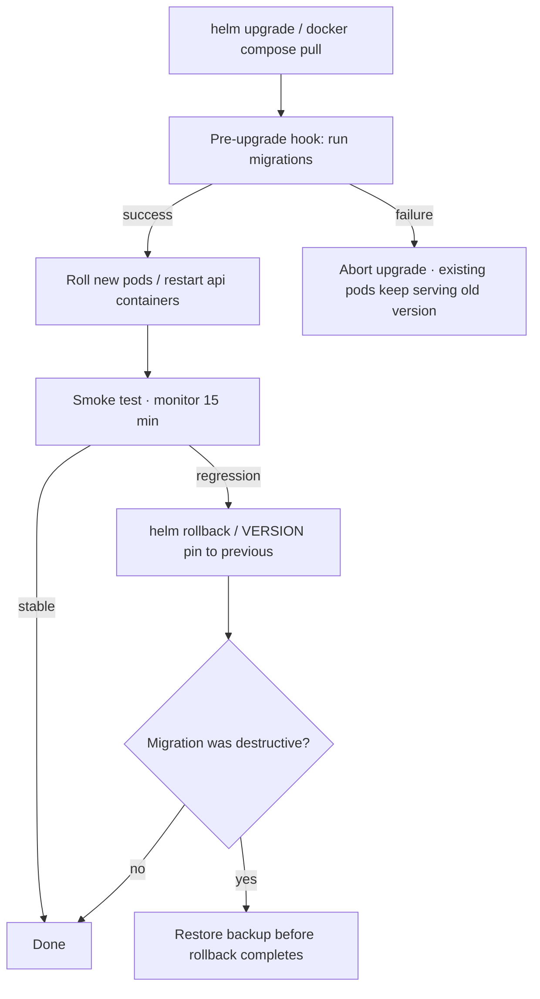

NodePad upgrades are designed to fail fast and fail safe: schema migrations run before any application pod rolls, and an upgrade that breaks migrations leaves your existing pods serving the old version.



## Upgrade checklist

<Steps>
  <Step title="Read the changelog" icon="book-open">
    Read the [changelog](/changelog) for the target version. Note any breaking changes.
  </Step>
  <Step title="Back up the database" icon="database">
    Take a backup before starting (commands below).
  </Step>
  <Step title="Verify the pre-upgrade hook" icon="check">
    For Kubernetes, verify the pre-upgrade hook succeeded before api pods roll.
  </Step>
  <Step title="Smoke-test after rollout" icon="activity">
    Hit `/api/health`, admin login, canvas load, LLM stream.
  </Step>
  <Step title="Monitor 15 minutes" icon="timer">
    Watch logs and error rates for 15 minutes post-rollout.
  </Step>
</Steps>

## Kubernetes (Helm)

### Upgrade

```bash
helm upgrade nodepad oci://ghcr.io/palazski/charts/nodepad \
  --version 0.3.0 \
  -f values.yaml
```

Schema migrations run automatically as a **pre-upgrade Helm hook** before any api/worker/beat pods roll. The upgrade fails fast if migrations fail; your existing pods keep serving on the old version.

### Rollback

```bash
# List release history
helm history nodepad

# Roll back to the previous revision
helm rollback nodepad <REVISION>
```

<Warning>
  **Helm rollback does NOT undo schema migrations.** If the forward migration was destructive (dropped columns, changed types), rolling the code back leaves the old code facing a newer schema.

  Mitigations:
  1. Keep migrations additive and backwards-compatible within a minor line.
  2. Before any destructive migration, back up the database (see below).
  3. Any non-reversible migration is flagged in the changelog for that release.
</Warning>

### Database backup before upgrade

<Tabs>
  <Tab title="External Postgres">
    ```bash
    pg_dump "$NODEPAD_DATABASE_URL" > nodepad-pre-v0.3.0.sql
    ```
  </Tab>
  <Tab title="Bundled Bitnami Postgres (POC only)">
    ```bash
    kubectl exec -it <release>-postgresql-0 -- \
      pg_dump -U nodepad nodepad > nodepad-pre-v0.3.0.sql
    ```
  </Tab>
</Tabs>

## Single-VM (docker compose)

### Upgrade

```bash
# 1. Pull new images (or load from an offline bundle)
docker compose pull

# 2. Restart with migrations enabled.
#    NODEPAD_RUN_MIGRATIONS_ON_START=1 is the compose default —
#    migrations run automatically on api container start.
docker compose up -d
```

### Rollback

The compose file reads `VERSION` from `.env`. Bump it and re-up:

```bash
sed -i 's|^VERSION=0.3.0|VERSION=0.2.4|' .env

docker compose pull
docker compose up -d

# If the upgrade included a destructive migration, restore from backup:
# docker compose exec db psql -U nodepad -d nodepad < nodepad-pre-v0.3.0.sql
```

## Migration-incompatible rollback

If you must roll a release back across an irreversible migration:

<Steps>
  <Step title="Quiesce writes">
    Scale api/worker/beat to 0 replicas.
  </Step>
  <Step title="Restore the database">
    Use the pre-upgrade backup.
  </Step>
  <Step title="Redeploy the old version">
    Pin to the previous semver tag.
  </Step>
  <Step title="Scale back up">
    Return replicas to their original values.
  </Step>
</Steps>

<Warning>
  This loses any data written after the upgrade. Plan migrations to avoid this when possible.
</Warning>
